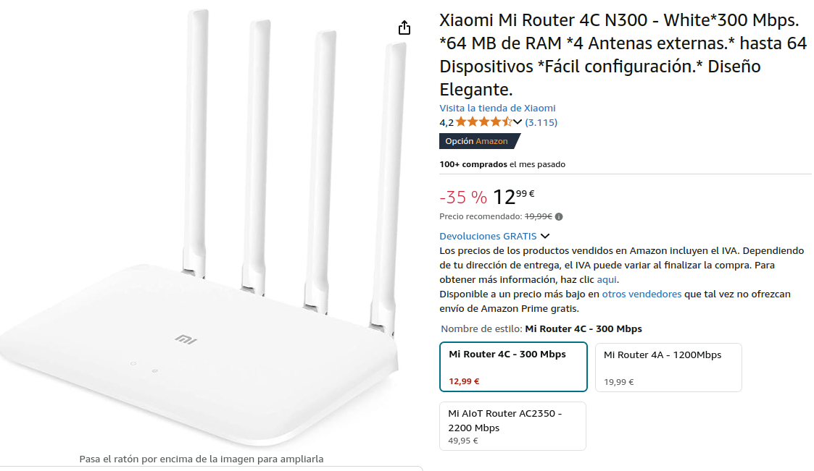

El martes pasado estábamos configurando nuevos routers para añadir más nodos a las redes mesh que tenemos actualmente. Para adelantar trabajo antes de viajar a Senegal, instalamos con éxito OpenWRT en los routers. Elegimos OpenWRT porque es un firmware de código abierto que nos da control total sobre los routers e incluye capacidades de redes mesh integradas, que son esenciales para nuestro proyecto de red comunitaria.

Estamos usando el Xiaomi Mi Router 4C, que es la mejor relación calidad-precio que hemos encontrado hasta ahora. ¡Ahora mismo podríamos comprarlos por 12,99€!

Pronto documentaremos una guía sobre cómo flashear OpenWRT en estos routers en nuestra sección de documentación técnica. Si estás familiarizado con este tipo de cosas, por ahora, puedes consultar esta antigua publicación. El único problema que tienen es que solo funcionan a 2,4 GHz, pero dado que nuestro objetivo es cubrir una gran área y el ancho de banda nunca es superior a 8 Mbps, nos sirve.

¡Estad atentos para más actualizaciones!

 enseñando a los nuevos miembros del equipo (izquierda) cómo flashear OpenWRT en los routers")