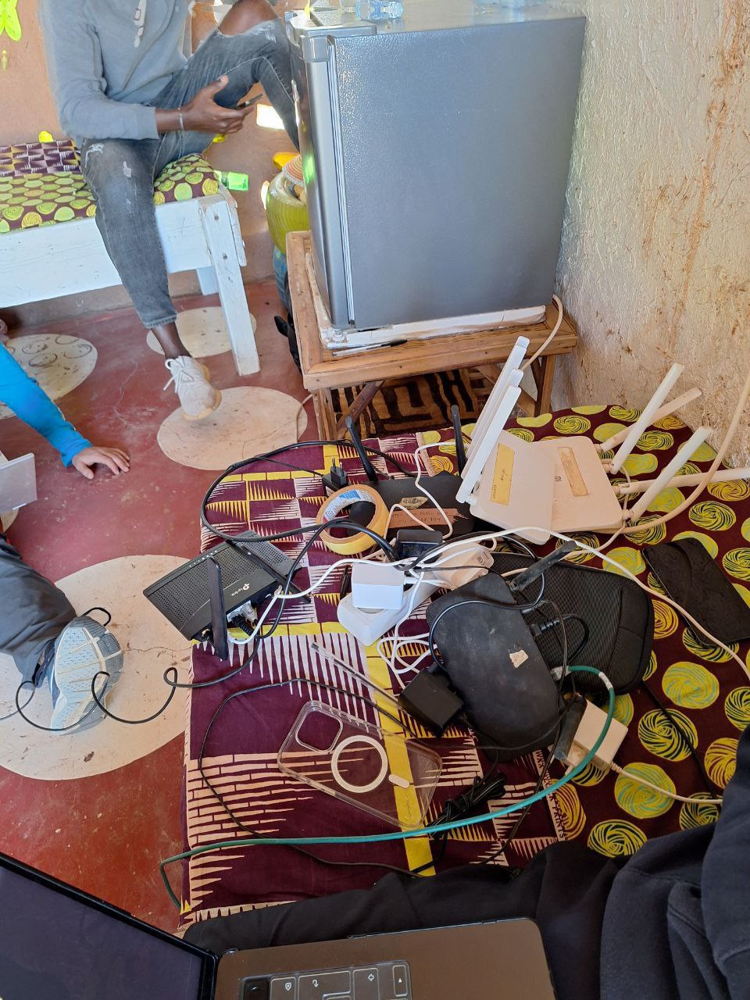

Today, Wednesday, started with a shared breakfast under the typical heat of Senegal, but the team kept their spirits high and motivation strong to continue with the technical progress of the project.

## Network Advances and Firewall Optimization

Joan and Jaume took a short break from their work with Zabbix to focus on improving the network configuration. They worked on centralizing the firewall rules of the routers with internet access so that, in some centers in Hahatay, there would be no internet during non-working hours, and in the residence, from 11:00 PM to 8:00 AM. This implementation had already been done on the master of each mesh, but it had one issue: by blocking the internet access, we couldn’t access routers from other areas when we needed to make configurations. Now, with this new solution, we can access the routers without issue, as we only block internet access.  

## The Challenge of Xiaomi Routers

Meanwhile, Roger and Aitor decided to stay in Sunukeur, as yesterday’s return had left them exhausted. They ran into some issues while trying to configure Xiaomi routers, which weren’t properly receiving commands from OpenWISP. It turns out Xiaomi released two versions of these routers with subtle hardware differences, which cause compatibility issues with the firmware required for OpenWISP installation. The installation and update process continued to be challenging, but it was a good opportunity to prepare replacement routers or replace those that had not yet been reviewed.  

## New Ideas and Challenges with Zabbix

After lunch, Joan and Jaume returned to work with Zabbix. While they didn’t make significant progress today, they discussed some ideas and started implementing new strategies to optimize network monitoring in the coming days.

## Solving the Radio Shutdown Issue

In the afternoon, Roger and Aitor worked on a problem that had arisen with several new routers: the radios were turned off. This prevented the routers from broadcasting wifi and communicating with the mesh network. After several attempts, they found some lines of code in the OpenWISP documentation that seemed to address the problem, but when implemented, they disabled other necessary interfaces. After much trial and error, they managed to solve the problem, and now the templates to configure slave and master routers are ready.

## Football Afternoon and a Memorable Dinner

At 6:30 PM, Aitor, Jaume, Joan, and Roger took a taxi to Saint Louis to watch the many Champions League matches playing that afternoon. They went to a very unique spot called *Le Montagne*. There, they had a large screen showing different matches, 20 minutes of each, as they were all playing at the same time.  

Later, Javier, one of Lorenzo and Pablo’s friends who is staying in Hahatay these days, joined them. It turned out that Javier works on various cooperation projects and has traveled across much of Africa and many other countries. We spent a good part of the night listening to his experiences—things he had seen, lived, and that had shaped his way of thinking and believing, all shared with humility and a smile.  

The night ended with a spectacular dinner: three grilled *poissons*, which were undoubtedly the highlight of the day. To wrap it up, we saw many locals buying a white brew in bulk at the restaurant, and Jaume couldn’t resist buying a bottle. It honestly didn’t smell or taste very good, but we all tried it, and thankfully no one had any stomach issues the next day.  
  

